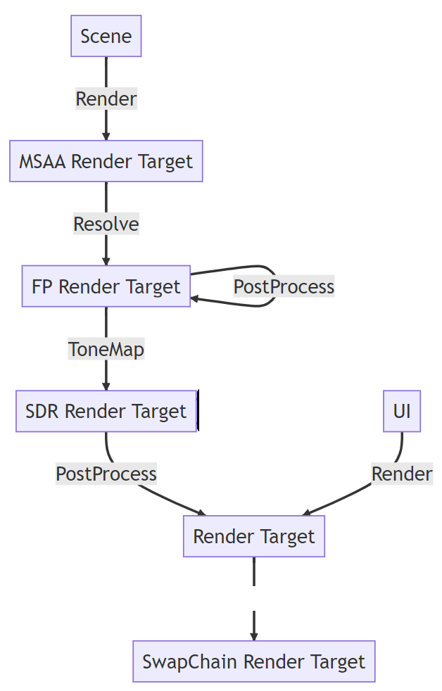

# My Renderer for Learning Computer Graphics

## Project Overview

Rendering Damaged Halmet by using **DirectX 11** API and the following techniques/effects

- **PBR**

- **Mirror**

- Fog

- Bloom

### Process

- **Render** : Rendering Models (mirror included)

- **PostProcess** : Bloom

- **ToneMap** : Exposure, Gamma

### PBR 및 그래픽스 학습자료 (개인자료)

- [PBR Intro](https://mgtruuuu.notion.site/PBR-Intro-4a7233f4cdc44e04bebea16ec86cd0eb)

- [Unreal PBR](https://mgtruuuu.notion.site/Unreal-PBR-1f5df2537bc7484aac96309f312b8fbe) 

- [Lecture note](https://mgtruuuu.notion.site/mgtruuuu/Computer-Graphics-3243be6f24384b1abfa97beef7e4bec3)

## Keyboard/Mouse Controls

    F : Turn on/off First Person View 
    W : Move forward
    S : Move backward
    D : Move right
    A : Move left
    E : Move up
    Q : Move down
    C : Capture current screen

    By dragging with the left mouse button, you can rotate an object.
    By dragging with the right mouse button, you can move an object.

## Youtube Link

- [click here](https://youtu.be/I5MiEi4Mo_A?si=CJx2EViv2ek7vMv4&t=77)